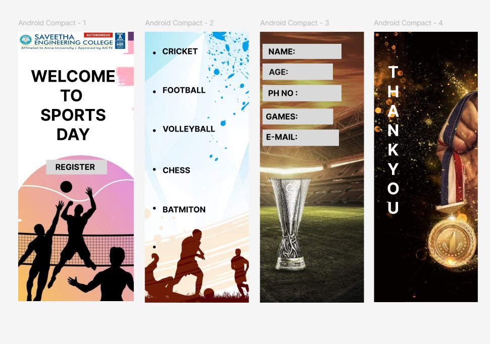

# Ex09 Event Registration Web Application
## Date:14/05/2025

## AIM:
To design, develop and deploy a web application for event registration.

## DESIGN STEPS:

### Step 1:
Create a new frame.

### Step 2:
Select any one preset size of your choice.

### Step 3:
Select the shapes you need.

### Step 4:
Import images as needed.

### Step 5:
Create pages based on your need and link them.

### Step 6:

Validate the HTML and CSS code.

### Step 6:

Publish the website in the given URL.

## DESIGN TOOL:
Figma

## CODE:
```
page 1
HTML 
<div class="container--0-">
<div class="text-0-1-1"><br />WELCOME TO <br />SPORTS DAY</div>
  <svg
    width="241"
    height="58"
    viewBox="0 0 241 58"
    fill="none"
    xmlns="http://www.w3.org/2000/svg"
  >
    <rect width="241" height="58" fill="#D9D9D9"></rect>
  </svg>
  <div class="text-0-1-3">REGISTER</div>
  <div class="container-0-1-4"></div>
</div>

css
.container--0- {
  position: absolute;
  left: 0px;
  top: -1784px;
  width: 458px;
  height: 1069px;
  background-color: #5c396e;
  justify-content: start;
  align-items: start;
}
.text-0-1-1 {
  width: 356px;
  height: 319px;
  color: #000000;
  font-size: 64px;
  font-family: Inter, "Bold";
  font-weight: 700;
  text-align: center;
  vertical-align: top;
}
.text-0-1-3 {
  width: 179.30401611328125px;
  height: 40.13115692138672px;
  color: #000000;
  font-size: 32px;
  font-family: Inter, "Bold";
  font-weight: 700;
  text-align: center;
  vertical-align: top;
}
.container-0-1-4 {
  position: absolute;
  left: 236px;
  top: 2287px;
  width: 100px;
  height: 100px;
  justify-content: start;
  align-items: start;
}

page 2

HTML

<div class="container--0-">

<div class="text-0-1-1">
    .<br /><br />.<br /><br />.<br /><br />.<br /><br />.<br /><br />.
  </div>
  <div class="text-0-1-2">CRICKET<br /></div>
  <div class="text-0-1-3">FOOTBALL</div>
  <div class="text-0-1-4">VOLLEYBALL</div>
  <div class="text-0-1-5">CHESS</div>
  <div class="text-0-1-6">BATMITON</div>
</div>

css

container--0- {
  position: absolute;
  left: 502px;
  top: -1784px;
  width: 412px;
  height: 1075px;
  background-color: #ffffff;
  justify-content: start;
  align-items: start;
}
.text-0-1-1 {
  width: 47px;
  height: 846px;
  color: #000000;
  font-size: 64px;
  font-family: Inter, "Bold";
  font-weight: 700;
  text-align: center;
  vertical-align: top;
}
.text-0-1-2 {
  width: 203px;
  height: 55px;
  color: #000000;
  font-size: 32px;
  font-family: Inter, "Bold";
  font-weight: 700;
  text-align: center;
  vertical-align: top;
}
.text-0-1-3 {
  width: 171px;
  height: 39px;
  color: #000000;
  font-size: 32px;
  font-family: Inter, "Bold";
  font-weight: 700;
  text-align: center;
  vertical-align: top;
}
.text-0-1-4 {
  width: 209px;
  height: 39px;
  color: #000000;
  font-size: 32px;
  font-family: Inter, "Bold";
  font-weight: 700;
  text-align: center;
  vertical-align: top;
}
.text-0-1-5 {
  width: 110px;
  height: 39px;
  color: #000000;
  font-size: 32px;
  font-family: Inter, "Bold";
  font-weight: 700;
  text-align: center;
  vertical-align: top;
}
.text-0-1-6 {
  width: 171px;
  height: 39px;
  color: #000000;
  font-size: 32px;
  font-family: Inter, "Bold";
  font-weight: 700;
  text-align: center;
  vertical-align: top;
} 

page 3

HTML

<div class="container--0-">
<svg
    width="313"
    height="65"
    viewBox="0 0 313 65"
    fill="none"
    xmlns="http://www.w3.org/2000/svg"
  >
    <rect width="313" height="65" fill="#D9D9D9"></rect></svg
  ><svg
    width="280"
    height="63"
    viewBox="0 0 280 63"
    fill="none"
    xmlns="http://www.w3.org/2000/svg"
  >
    <rect width="280" height="63" fill="#D9D9D9"></rect></svg
  ><svg
    width="303"
    height="65"
    viewBox="0 0 303 65"
    fill="none"
    xmlns="http://www.w3.org/2000/svg"
  >
    <rect width="303" height="65" fill="#D9D9D9"></rect></svg
  ><svg
    width="313"
    height="60"
    viewBox="0 0 313 60"
    fill="none"
    xmlns="http://www.w3.org/2000/svg"
  >
    <rect width="313" height="60" fill="#D9D9D9"></rect></svg
  ><svg
    width="279"
    height="65"
    viewBox="0 0 279 65"
    fill="none"
    xmlns="http://www.w3.org/2000/svg"
  >
    <rect width="279" height="65" fill="#D9D9D9"></rect>
  </svg>
  <div class="text-0-1-8">NAME:</div>
  <div class="text-0-1-9">AGE:</div>
  <div class="text-0-1-10">PH NO :</div>
  <div class="text-0-1-11">GAMES:</div>
  <div class="text-0-1-12">E-MAIL:</div>
</div>

css

.container--0- {
  position: absolute;
  left: 958px;
  top: -1784px;
  width: 412px;
  height: 1075px;
  background-color: #ffffff;
  justify-content: start;
  align-items: start;
}
.text-0-1-8 {
  width: 153px;
  height: 39px;
  color: #000000;
  font-size: 32px;
  font-family: Inter, "Bold";
  font-weight: 700;
  text-align: center;
  vertical-align: top;
}
.text-0-1-9 {
  width: 103px;
  height: 39px;
  color: #181717;
  font-size: 32px;
  font-family: Inter, "Bold";
  font-weight: 700;
  text-align: center;
  vertical-align: top;
}
.text-0-1-10 {
  width: 118px;
  height: 39px;
  color: #000000;
  font-size: 32px;
  font-family: Inter, "Bold";
  font-weight: 700;
  text-align: center;
  vertical-align: top;
}
.text-0-1-11 {
  width: 127px;
  height: 39px;
  color: #000000;
  font-size: 32px;
  font-family: Inter, "Bold";
  font-weight: 700;
  text-align: center;
  vertical-align: top;
}
.text-0-1-12 {
  width: 125px;
  height: 39px;
  color: #000000;
  font-size: 32px;
  font-family: Inter, "Bold";
  font-weight: 700;
  text-align: center;
  vertical-align: top;
}

page 4

HTML
<div class="container--0-">

<div class="text-0-1-1">
    T<br />H<br />A<br />N<br />K<br />Y<br />O<br />U
  </div>
</div>

css
.container--0- {
  position: absolute;
  left: 1410.077392578125px;
  top: -1784px;
  width: 411px;
  height: 1073px;
  background-color: #ffffff;
  justify-content: start;
  align-items: start;
}
.text-0-1-1 {
  width: 102px;
  height: 708px;
  color: #ffffff;
  font-size: 64px;
  font-family: Inter, "Bold";
  font-weight: 700;
  text-align: center;
  vertical-align: top;
}

```
## OUTPUT:




## RESULT:
The program to design, develop and deploy a web application for event registration is completed successfully.
